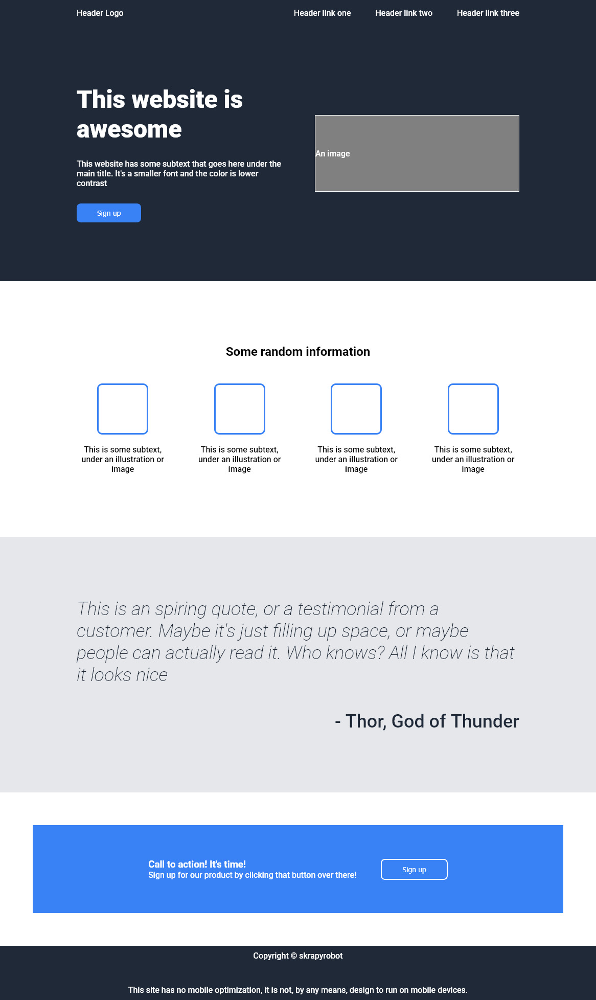

# Landing Page

> Man cannot discover new oceans unless he has the courage to lose sight of the shore.
>
> Andre Gide

The current site was created as part of [the odin project](https://www.theodinproject.com/), specifically, [this lesson](https://www.theodinproject.com/lessons/foundations-landing-page).

## The objective

The main goal of it, is to replicate the following site:

## My attempt

Although it is not required to be a pixel perfect replica, this was my best try at that moment:
In fact, you can check this very page hosted [at this URL](https://skrapyrobot.github.io/od_landing-page/)

A modification I've done is I've added media queries to make the site a little responsive, specially on mobile

---
